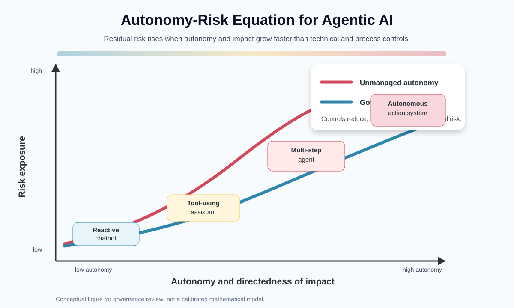
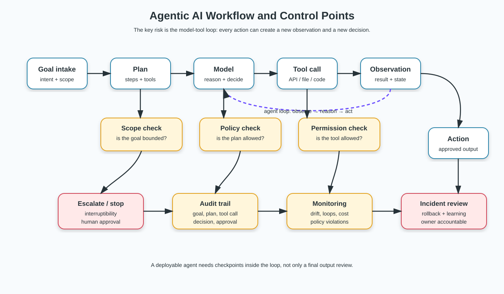
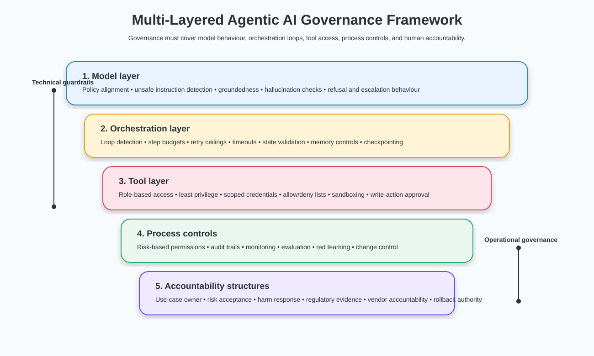
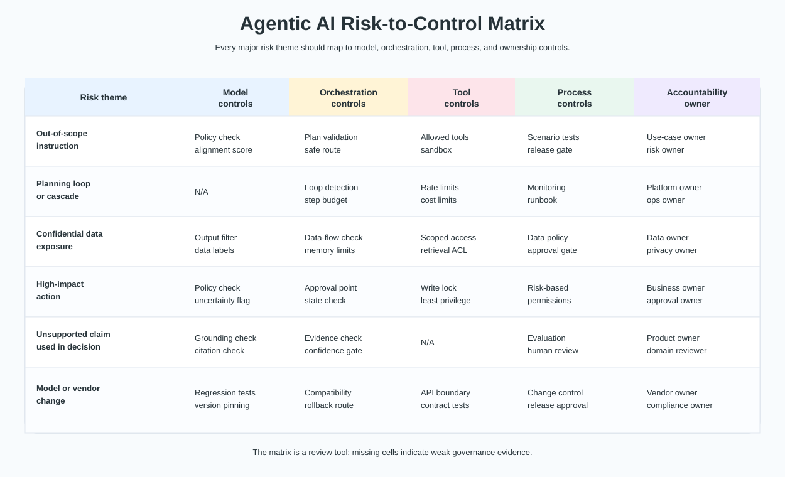
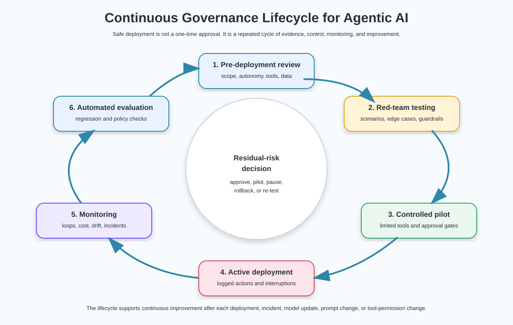

# Agentic AI Risk Management: Figures and Flowcharts

This visual companion supports the full report:

```text
docs/agentic-ai-risk-management-full-report.md
```

The figures are original, public-safe SVG assets created for this repository. They translate the Agentic AI governance concepts into reviewer-friendly diagrams.

## Figure 1 — Autonomy, control maturity, and residual risk



**Purpose.** This graph shows the central risk argument: as autonomy and directedness of impact increase, unmanaged risk rises. Stronger governance controls can reduce residual risk, but they do not remove it completely.

**Use in review.** Place this near the beginning of the report to explain why agentic systems need stronger controls than ordinary prompt-response systems.

## Figure 2 — Agentic workflow with control checkpoints



**Purpose.** This flowchart shows the real system problem: an agent receives a goal, plans, reasons, calls tools, observes results, and continues the loop. Controls must be inserted inside the loop rather than only after the final output.

**Control points shown.**

- goal-scope checks;
- policy checks;
- permission checks;
- escalation and stop points;
- audit trail;
- monitoring;
- incident review.

## Figure 3 — Multi-layered governance stack



**Purpose.** This diagram shows the layered governance model used in the report.

| Layer | Meaning |
|---|---|
| Model layer | policy alignment, unsafe-instruction detection, hallucination and groundedness checks |
| Orchestration layer | loop detection, step budgets, timeout limits, retry ceilings, state validation |
| Tool layer | role-based access, scoped credentials, sandboxing, allowed and blocked actions |
| Process controls | risk-based permissions, audit trails, monitoring, red teaming, change control |
| Accountability structures | owners for harm response, regulatory evidence, vendor behaviour, and rollback authority |

## Figure 4 — Risk-to-control matrix



**Purpose.** This matrix turns the governance framework into a review tool. Each major risk theme should map to model-level controls, orchestration controls, tool controls, process controls, and accountable ownership.

**Review interpretation.** Empty or weak cells indicate missing governance evidence. A system may have strong model-level filters but still be unsafe if the tool layer, approval process, monitoring, or accountability is weak.

## Figure 5 — Continuous governance lifecycle



**Purpose.** This lifecycle diagram shows that safe deployment is not a one-time approval. Agentic AI needs continuous review, monitoring, automated evaluation, incident learning, and re-testing after changes.

**Lifecycle stages.**

1. Pre-deployment review
2. Red-team testing
3. Controlled pilot
4. Active deployment
5. Monitoring
6. Automated evaluation
7. Incident review and improvement

## How these figures map to the full report

| Full report section | Recommended figure |
|---|---|
| Executive summary and autonomy-risk equation | Figure 1 |
| From responsive AI to Agentic AI | Figure 2 |
| Multi-layered governance framework | Figure 3 |
| Example control matrix and reviewer questions | Figure 4 |
| Continuous lifecycle of safe deployment | Figure 5 |

## Public-safe scope

The figures are original repository assets. They do not copy the uploaded slide graphics directly and do not include confidential or organisation-specific material.
