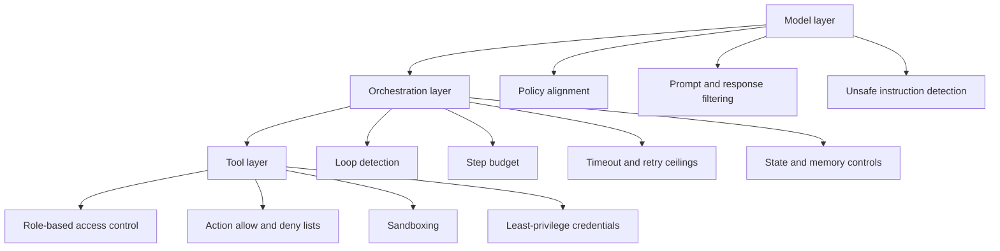

# Agentic AI Risk and Governance Framework

Agentic AI changes the assurance problem because the system can plan, call tools, pass outputs between components, and take actions with reduced human correction. The central governance question is not only whether the model gives a good answer, but whether the full autonomous workflow remains controlled.

## 1. Why agentic AI is different

Classical ML and many generative AI systems are mostly responsive: an input is provided and the system returns an output. Agentic AI can use one model output as the next model input, pursue a goal over several steps, and execute tool calls. The supplied source describes this transition from responsive tools to autonomous agents and highlights that complex workflow automation can create a critical vulnerability when decisions happen without human oversight.

## 2. Four autonomy dimensions

| Dimension | Practical meaning | Risk question |
|---|---|---|
| Underspecification | The agent receives a broad goal rather than detailed steps | Could it choose an unsafe or non-compliant route to satisfy the goal? |
| Long-term planning | The agent makes sequential decisions over time | Could early errors compound across later steps? |
| Goal directedness | The system actively works toward an outcome | Could it optimise the wrong proxy or ignore implicit constraints? |
| Directedness of impact | The system can directly affect data, users, systems, or processes | Could impact occur before a human can intervene? |

A fifth operational dimension is **autonomous action**: whether the system can perform actions through tools, APIs, files, emails, code execution, payments, transactions, or physical devices.

## 3. Amplified risk categories

Agentic systems amplify several existing AI risks:

| Risk | Why autonomy amplifies it |
|---|---|
| Misinformation | False outputs can feed later steps and become operational decisions |
| Decision-making error | A poor intermediate decision can compound through a long plan |
| Security vulnerability | Tool access gives attackers more ways to convert model behaviour into real actions |
| Loss of oversight | Fewer human checkpoints mean fewer opportunities for correction |
| Unmanaged autonomy | Broad goals and tools can create unexpected action paths |

## 4. Three-layer technical guardrails



### Model layer

Model-layer controls check whether instructions, intermediate reasoning, and outputs remain aligned with organisational policy and human expectations. They should detect attempts to force harmful, deceptive, non-compliant, or out-of-scope behaviour.

### Orchestration layer

Orchestration-layer controls manage the agent loop. They should detect infinite loops, uncontrolled retries, tool-call cascades, escalating cost, repeated failures, memory corruption, and plan drift.

### Tool layer

Tool-layer controls define what the agent is technically allowed to do. This layer should enforce role-based access, least privilege, read/write separation, sandboxing, and hard limits on irreversible or high-impact actions.

## 5. Process controls

| Control | Evidence expected |
|---|---|
| Risk-based permissions | Clear list of actions the agent may, may not, and must never perform autonomously |
| Auditability | Logs for goals, prompts, retrieved evidence, tool calls, observations, decisions, approvals, and failures |
| Monitoring and evaluation | Continuous checks for hallucination, policy violation, loop behaviour, tool misuse, and compliance drift |
| Red teaming | Pre-deployment adversarial tests covering model, orchestration, data, and tool layers |
| Change control | Re-assessment after prompt, model, tool, dataset, permission, or orchestration changes |

## 6. Accountability structures

Agentic governance must define the human and organisational ownership above the machine logic:

- who owns the use case;
- who approves autonomy level and tool access;
- who accepts residual risk;
- who investigates harm;
- who handles compliance evidence;
- who owns third-party model and vendor obligations;
- who can suspend or roll back the agent.

## 7. Residual-risk scoring

The repository includes a lightweight scoring utility:

```text
src/learn_ai_evaluation/agentic_risk.py
examples/agentic-ai-governance/agentic_risk_register_example.py
tests/test_agentic_risk.py
```

The utility scores autonomy exposure and control maturity on a 0 to 5 scale. It then estimates residual risk and recommends actions for weak controls. This is not a regulatory scoring tool; it is a transparent educational method for comparing risk before and after governance controls.

Run:

```bash
python examples/agentic-ai-governance/agentic_risk_register_example.py
python -m pytest tests/test_agentic_risk.py -q
```

## 8. Agentic AI review checklist

Use this before deployment:

- [ ] The agent's goal is specific enough to test.
- [ ] Autonomy dimensions have been scored.
- [ ] Every tool has a clear owner and permission boundary.
- [ ] Irreversible or high-impact actions require human approval.
- [ ] The agent has request-level and system-level interruptibility.
- [ ] The orchestration loop has step, time, retry, and cost limits.
- [ ] Logs support reconstruction of the full decision chain.
- [ ] Confidential data is detected, minimised, masked, or blocked.
- [ ] Red-team findings are tracked and closed before release.
- [ ] Automated monitoring is active after deployment.
- [ ] A named person or team owns harm response and rollback.

## 9. Key lesson

Governance is not only about security. It is about maintaining control when AI systems become capable of planning and acting. Before letting an agent act on behalf of an organisation, the system needs technical guardrails, process controls, continuous monitoring, and human accountability.
