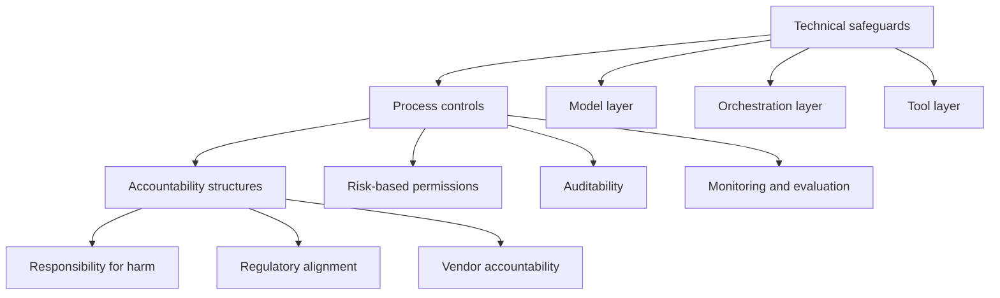
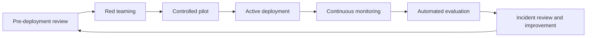

# Full Report: Agentic AI Risk Management and Governance

## Executive summary

Agentic AI changes the risk profile of AI systems because the system is no longer limited to producing a single response to a single prompt. An agentic system can receive a broad goal, plan across multiple steps, pass outputs between models or tools, and take actions that affect data, software systems, business processes, or users. This makes governance a control problem, not only a model-evaluation problem.

The core principle of this report is:

> **As autonomy increases, unmanaged risk also increases unless governance controls increase at the same time.**

The practical response is a multi-layered governance approach that combines technical guardrails, process controls, continuous evaluation, and clear human accountability.

## Source basis

This report is an original public-safe synthesis based on the user-supplied Agentic AI governance materials. The uploaded material frames agentic AI as a move from responsive tools to autonomous systems, contrasts classical ML/generative AI with agentic AI, identifies four structural dimensions of agentic autonomy, and proposes governance through technical safeguards, process controls, accountability structures, red teaming, monitoring, and observability.

The report does not reproduce the original slide deck or images. It converts the ideas into a reusable GitHub-ready technical report, checklist, and review framework.

## 1. From responsive AI to agentic AI

Traditional AI systems are usually evaluated as bounded input-output systems:

```text
Input -> model -> output
```

Agentic AI introduces a different pattern:

```text
Goal -> planning -> model/tool loop -> action -> observation -> next action
```

This shift matters because a single model output may become the next model input, the next tool call, the next decision, or the next business action. As a result, risk can propagate through a chain of decisions rather than remaining isolated at one output.

## 2. Classical ML and generative AI versus agentic AI

| Aspect | Classical ML / Generative AI | Agentic AI |
|---|---|---|
| Primary behaviour | Responds to an input | Pursues a goal |
| Architecture | Usually one model or a bounded pipeline | Multi-step loop of models, tools, memory, and actions |
| Human involvement | Often direct prompting, review, or oversight | Fewer checkpoints unless explicitly designed |
| Risk pattern | Output-level errors | Action-chain and workflow-level failures |
| Evaluation focus | Accuracy, robustness, fairness, hallucination, safety | All model risks plus planning, tool use, action control, auditability, and accountability |

Agentic AI therefore does not replace classical AI risk management. It extends it. Every ordinary model risk still exists, but the consequences can become larger because the agent can act on those outputs.

## 3. The autonomy-risk equation

Agentic AI risk is driven by the combination of autonomy and impact. A useful practical equation is:

```text
Agentic risk = autonomy exposure x action impact x control weakness
```

This equation is intentionally simple. It reminds reviewers that risk is not created only by model capability. Risk becomes serious when capability is connected to tools, permissions, long-term planning, sensitive data, and weak governance.

## 4. Five autonomy dimensions

The source material identifies four structural dimensions of agentic autonomy. This report keeps those four and adds one practical operational dimension: autonomous action.

### 4.1 Underspecification

Underspecification occurs when the agent receives a broad goal without detailed instructions on how the goal should be achieved.

Example:

```text
Find the best supplier and complete the procurement process.
```

This instruction may hide many policy-sensitive decisions: what counts as best, what budget applies, which vendors are allowed, what approvals are required, and whether data can be shared externally.

Risk created by underspecification:

- the agent may choose a non-compliant route;
- implicit constraints may be ignored;
- success criteria may be misinterpreted;
- hidden assumptions may become operational decisions;
- reviewers may not know which decision path the agent selected.

Required controls:

- explicit goal boundaries;
- allowed and disallowed actions;
- tool permissions tied to risk level;
- human approval for ambiguous or high-impact steps;
- traceable planning logs.

### 4.2 Long-term planning

Long-term planning occurs when the agent makes sequential decisions that build on one another.

Risk created by long-term planning:

- early mistakes can compound;
- hallucinated information can become an input to later steps;
- planning loops can consume resources;
- the final action may be far removed from the original prompt;
- humans may struggle to reconstruct the decision path.

Required controls:

- step budgets;
- retry limits;
- timeouts;
- loop detection;
- intermediate checkpoints;
- audit trails for every plan revision and tool call.

### 4.3 Goal directedness

Goal directedness means the system is not merely responding to a prompt but actively working toward an outcome.

Risk created by goal directedness:

- the system may optimise the wrong proxy;
- it may treat constraints as obstacles;
- it may over-prioritise task completion over safety;
- it may continue acting even when the context has changed;
- it may produce persuasive but unsupported reasoning to justify the plan.

Required controls:

- objective validation;
- policy-aware planning;
- explicit stop conditions;
- monitoring of goal drift;
- review of optimisation targets and success metrics.

### 4.4 Directedness of impact

Directedness of impact means the agent can directly affect data, systems, users, workflows, or external services.

Risk created by directedness of impact:

- decisions can cause harm before a human intervenes;
- sensitive data may be changed, disclosed, or deleted;
- tool misuse can create security or compliance failures;
- actions may become difficult to reverse;
- accountability may become unclear.

Required controls:

- risk-based permissions;
- read/write separation;
- sandboxing;
- human approval for high-impact actions;
- rollback mechanisms;
- incident response ownership.

### 4.5 Autonomous action

Autonomous action is the practical capability to execute operations through tools, APIs, files, emails, code, workflows, transactions, or physical systems.

Risk created by autonomous action:

- model error becomes operational action;
- prompt injection can become tool misuse;
- external systems may trust the agent too much;
- actions may be performed at machine speed;
- repeated autonomous actions may create cascading failures.

Required controls:

- least-privilege credentials;
- action allow lists and deny lists;
- execution approval gates;
- rate limits;
- transaction limits;
- monitoring and alerting.

## 5. Amplified risk categories

Agentic AI amplifies familiar AI risks because errors are no longer confined to a single answer. They can become decisions, tool calls, or system changes.

### 5.1 Misinformation and hallucination propagation

In a normal chatbot, misinformation may mislead a user. In an agentic workflow, misinformation can become a downstream input and trigger later actions.

Controls:

- evidence grounding;
- retrieval traceability;
- source quality checks;
- claim verification;
- hallucination monitoring;
- human approval for uncertain claims used in high-impact decisions.

### 5.2 Decision-making errors

Agentic systems may make a sequence of decisions. A weak decision early in the workflow can distort all later steps.

Controls:

- intermediate review points;
- decision logging;
- independent validation of critical steps;
- scenario testing;
- auditability of decision chains.

### 5.3 Security vulnerabilities

Agentic AI increases the attack surface because an agent may have access to tools, credentials, memory, files, APIs, or external services.

Controls:

- prompt-injection testing;
- tool-call validation;
- RBAC;
- scoped credentials;
- sandboxing;
- data-loss prevention;
- red teaming before deployment.

### 5.4 Lack of human oversight

Autonomy reduces opportunities for domain experts to correct errors. This is not automatically bad, but it requires deliberate design.

Controls:

- human-in-the-loop triggers;
- approval gates;
- interruptibility;
- escalation rules;
- real-time monitoring for high-impact workflows.

### 5.5 Unmanaged autonomy

Unmanaged autonomy occurs when an agent has broad goals, broad tools, insufficient monitoring, and unclear accountability.

Controls:

- deployment gating;
- risk-based permission boundaries;
- autonomous-action limits;
- named accountability owner;
- post-deployment evaluation.

## 6. Multi-layered governance framework

Agentic governance should be implemented as a layered control system.



## 7. Technical safeguards

Technical safeguards are engineered controls embedded directly into the agentic system.

### 7.1 Interruptibility

Interruptibility means the ability to pause, stop, or disable a request, workflow, tool, or entire agent.

Minimum requirements:

- request-level stop;
- workflow-level stop;
- system-level disablement;
- manual override;
- emergency rollback;
- clear ownership of who can interrupt the system.

Reviewer questions:

- Can the agent be stopped during execution?
- Can one unsafe tool be disabled without disabling the whole system?
- Is there a manual override for high-risk workflows?
- Are interrupt events logged and reviewed?

### 7.2 Human-in-the-loop approval

Human-in-the-loop control must be specific. It is not enough to say that humans supervise the system.

Approval should be required when:

- the action is irreversible;
- the action affects customers, patients, employees, finances, legal status, or safety;
- the agent wants to access sensitive data;
- the system confidence is low;
- the agent proposes a new action path not previously approved;
- the action exceeds a monetary, operational, or data-access threshold.

### 7.3 Confidential data treatment

Agentic AI can expose confidential data through prompts, memory, tool calls, logs, retrieval, or generated outputs.

Controls:

- data minimisation;
- PII detection;
- masking and redaction;
- memory retention limits;
- retrieval access control;
- secure logging;
- separation between training data, runtime memory, and audit logs.

## 8. Three technical guardrail layers

### 8.1 Model layer: policy alignment

The model layer checks prompts, intermediate outputs, plans, and final answers against policy and safety requirements.

Controls:

- prompt filtering;
- unsafe instruction detection;
- output policy checking;
- groundedness checks;
- refusal and escalation behaviour;
- model-specific safety tests.

Review evidence:

- policy test set;
- harmful instruction test set;
- hallucination and unsupported-claim metrics;
- refusal and over-refusal results;
- known limitation register.

### 8.2 Orchestration layer: loop and workflow control

The orchestration layer manages the agent loop.

Controls:

- loop detection;
- maximum step count;
- maximum retries;
- maximum runtime;
- maximum tool-call cost;
- state validation;
- memory validation;
- checkpointing and approval gates.

Review evidence:

- loop test cases;
- timeout tests;
- retry-limit tests;
- state-corruption tests;
- cost-limit tests;
- plan-drift analysis.

### 8.3 Tool layer: role-based access and action control

The tool layer controls what the agent can do.

Controls:

- role-based access control;
- least privilege;
- scoped credentials;
- tool allow lists;
- tool deny lists;
- read-only defaults;
- write-action approval;
- sandboxed execution;
- transaction and rate limits.

Review evidence:

- permission matrix;
- tool inventory;
- credential scope evidence;
- sandbox configuration;
- audit logs for tool calls;
- tests for blocked actions.

## 9. Process controls

### 9.1 Risk-based permissions

Risk-based permissions define what the agent can do autonomously, what it can do with approval, and what it must never do.

| Action class | Permission approach |
|---|---|
| Low-impact read-only task | May be autonomous with monitoring |
| Moderate-impact recommendation | May be autonomous, but logged and reviewable |
| High-impact change | Requires approval |
| Irreversible or safety-critical action | Prohibited or requires formal controlled process |
| Sensitive-data action | Requires data policy check and approval |

### 9.2 Auditability

Auditability is the ability to reconstruct how the agent reached a decision.

An agentic audit trail should include:

- original goal;
- user instruction;
- system prompt or policy context;
- retrieved evidence;
- intermediate plan;
- model outputs;
- tool calls;
- tool responses;
- approvals;
- rejected actions;
- errors;
- final action;
- monitoring result.

### 9.3 Monitoring and evaluation

Agentic AI requires continuous monitoring because risk persists after deployment.

Monitoring should cover:

- hallucination;
- unsupported claims;
- compliance violation;
- tool misuse;
- loop behaviour;
- cost spikes;
- latency spikes;
- unusual data access;
- failed approvals;
- repeated retries;
- drift in task distribution.

### 9.4 Red teaming

Red teaming is pre-deployment adversarial testing of the full agentic workflow.

Agentic red teaming should test:

- prompt injection;
- tool misuse;
- data exfiltration attempts;
- bypass of approval gates;
- loop creation;
- unsafe goal interpretation;
- false evidence injection;
- memory poisoning;
- policy conflict handling;
- vendor-model failure modes.

Red teaming is not a one-time event. It should be repeated after major model, prompt, tool, permission, data, or orchestration changes.

## 10. Accountability structures

Technical controls are insufficient unless human responsibility is defined.

### 10.1 Responsibility for harm

Before deployment, the organisation should answer:

- who owns the use case;
- who approves the autonomy level;
- who accepts residual risk;
- who handles harm investigation;
- who has rollback authority;
- who communicates incidents;
- who ensures corrective action.

### 10.2 Regulatory alignment

Regulatory alignment should be use-case specific. The relevant obligations depend on the sector, geography, data type, user group, and impact level.

A reviewer should ask:

- what legal or regulatory obligations apply;
- whether the agentic workflow changes the classification of the system;
- whether autonomy affects transparency, consent, safety, or accountability duties;
- what evidence is retained for audit or inspection.

### 10.3 Vendor accountability

Many agentic systems rely on third-party models, tools, APIs, cloud services, or orchestration frameworks.

Vendor governance should include:

- model and service versioning;
- service-level commitments;
- security and privacy obligations;
- incident notification duties;
- audit support;
- change notification;
- restrictions on data use;
- evidence of vendor testing and monitoring;
- clear allocation of responsibility.

## 11. Continuous lifecycle of safe deployment

Agentic AI governance should follow a lifecycle:



### Pre-deployment

- define intended use;
- score autonomy;
- assess controls;
- define approval gates;
- test tools;
- run red teaming;
- document residual risk.

### Active deployment

- enforce guardrails;
- monitor tool calls;
- log decisions;
- apply approval gates;
- detect loops;
- handle incidents.

### Post-deployment

- run automated evaluations;
- review logs;
- analyse drift;
- update risk register;
- re-test after changes;
- review accountability evidence.

## 12. Reviewer-style assessment questions

A strong GitHub reviewer, auditor, or technical lead should ask the following.

### System boundary

1. What is the agent allowed to decide?
2. What is the agent allowed to do?
3. Which tools are connected?
4. Which actions are read-only and which are write actions?
5. Which actions can affect users, money, safety, legal rights, or sensitive data?

### Autonomy

6. How broad is the goal specification?
7. How many steps can the agent perform before review?
8. Can it create or modify its own plan?
9. Can it call external tools without approval?
10. Can it act on generated information without verification?

### Controls

11. What stops an unsafe action?
12. What forces human approval?
13. What detects loops?
14. What prevents tool misuse?
15. What protects confidential data?
16. What records the decision chain?

### Evidence

17. What red-team scenarios were tested?
18. What automated evaluations run after deployment?
19. What monitoring alerts exist?
20. What happens after a failed evaluation?
21. Who reviews logs?
22. Who accepts residual risk?

## 13. Agentic risk register structure

Use the following structure when documenting an agentic system.

| Field | Description |
|---|---|
| Use case | What the agent is intended to do |
| Autonomy level | How much it can plan and act independently |
| Connected tools | APIs, files, email, code, search, databases, workflow systems |
| Data categories | Public, internal, confidential, personal, regulated |
| High-impact actions | Actions requiring approval or prohibition |
| Guardrails | Model, orchestration, and tool-layer controls |
| Monitoring | Runtime metrics and automated evaluations |
| Accountability owner | Named owner for risk and harm response |
| Residual risk | Risk after controls are implemented |
| Deployment decision | Not approved, pilot, limited release, full release |

## 14. Example control matrix

| Risk scenario | Model layer | Orchestration layer | Tool layer | Process control | Accountability |
|---|---|---|---|---|---|
| Agent follows malicious instruction | Instruction filtering | Stop unsafe plan | Block harmful tools | Red teaming | Security owner |
| Agent enters loop | N/A | Loop detection, step budget | Rate limits | Monitoring | System owner |
| Agent exposes sensitive data | Output filter | Data-flow validation | Access control | Data policy review | Data owner |
| Agent takes high-impact action | Policy check | Approval checkpoint | Write-action lock | Risk-based permissions | Use-case owner |
| Agent makes unsupported claim | Grounding check | Evidence validation | N/A | Automated evaluation | Product owner |
| Vendor model changes behaviour | Regression tests | Version pinning | API boundary checks | Change control | Vendor owner |

## 15. Maturity model

| Level | Description | Typical evidence |
|---|---|---|
| Level 0: Unmanaged | Agent has broad goals and weak controls | No clear owner, weak logging, broad tools |
| Level 1: Basic | Some prompts and outputs are checked | Manual review, limited tests |
| Level 2: Controlled | Tools, approvals, and logs are defined | Permission matrix, audit logs, HITL gates |
| Level 3: Monitored | Continuous evaluation and observability are active | Runtime alerts, automated checks, dashboards |
| Level 4: Governed | Lifecycle governance and accountability are integrated | Risk register, red-team closure, change control, accountable owners |
| Level 5: Assured | Evidence is repeatable, reviewed, and maintained | Independent review, scenario coverage, trend monitoring, formal release gates |

## 16. Practical implementation sequence

1. Define the agent boundary.
2. List all tools and actions.
3. Classify actions by impact.
4. Score autonomy dimensions.
5. Define risk-based permissions.
6. Implement model-layer controls.
7. Implement orchestration controls.
8. Implement tool-layer controls.
9. Add interruptibility and approval gates.
10. Add audit logging.
11. Run red teaming.
12. Deploy only as a controlled pilot.
13. Monitor continuously.
14. Reassess after every major change.

## 17. Integration with the repository code

The repository includes a lightweight implementation:

```text
src/learn_ai_evaluation/agentic_risk.py
examples/agentic-ai-governance/agentic_risk_register_example.py
tests/test_agentic_risk.py
```

The scoring utility is intentionally simple and transparent. It helps reviewers compare autonomy exposure with mitigation maturity and identify missing controls. It is not a replacement for domain-specific legal, safety, security, or regulatory assessment.

## 18. Final reviewer conclusion

Agentic AI should not be evaluated as only a language model, a chatbot, or a generic automation workflow. It should be evaluated as an autonomous decision-and-action system. The key risks arise from underspecified goals, sequential planning, goal-directed behaviour, direct impact, and tool-enabled autonomous action.

A strong governance framework therefore needs:

- technical safeguards at model, orchestration, and tool layers;
- interruptibility and human approval gates;
- confidential data treatment;
- risk-based permissions;
- auditability and observability;
- red teaming before deployment;
- continuous monitoring after deployment;
- clear responsibility for harm, compliance, and vendor behaviour.

The final message is simple: **before an AI system acts on behalf of an organisation, the organisation must prove that the agent remains controllable, observable, interruptible, accountable, and aligned with its intended use.**
