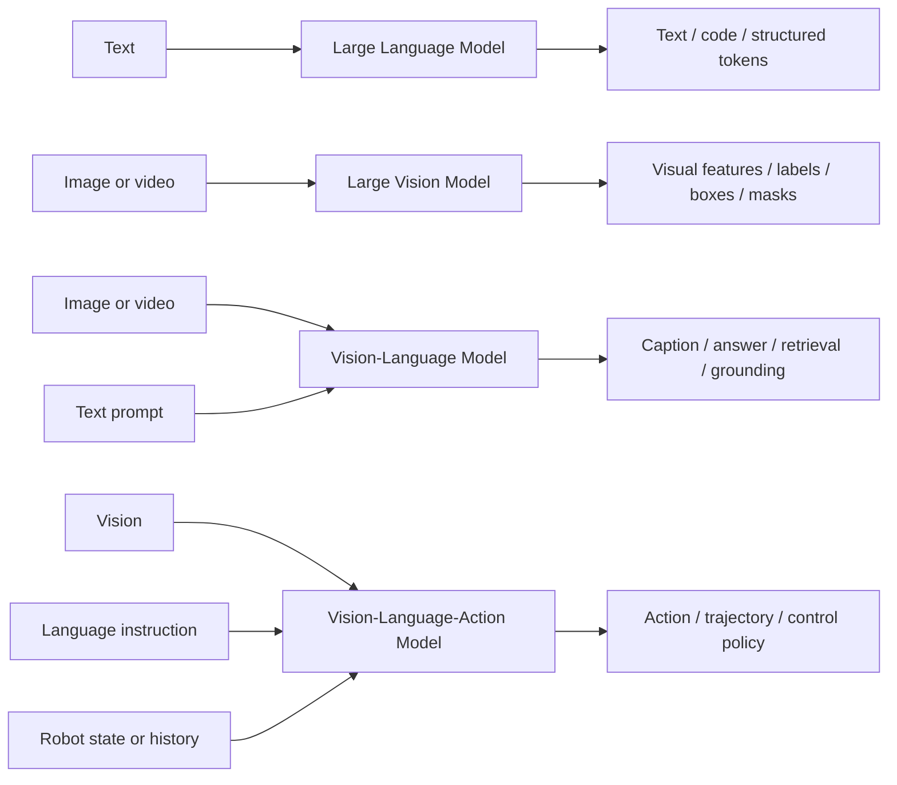

# LLM, Large Vision Model, VLM, and VLA: A Practical Taxonomy

These terms describe related but different model families. They should not be used interchangeably because their inputs, outputs, training data, failure modes, and evaluation evidence are different.

> Terminology note: **LVM** is used here for **large vision model** or **vision foundation model**. The term is less standardised than LLM or VLM and can be confused with **large vision-language model**. For clarity, this repository writes out “large vision model” and uses **VLM** for vision-language model.

## 1. Model-family comparison

| Model family | Primary inputs | Primary outputs | Core capability | Typical examples |
|---|---|---|---|---|
| Large language model (LLM) | Text or token sequences | Text, tokens, structured text, code | Language understanding and generation | GPT-style models, BERT-family encoders, Llama-family models |
| Large vision model / vision foundation model | Images or video | Visual embeddings, classes, boxes, masks, keypoints, depth, visual features | General-purpose visual representation and perception | DINOv2, Segment Anything, large ViT-based backbones |
| Vision-language model (VLM) | Images/video plus text, or one modality queried through the other | Text, similarity scores, retrieved items, visual regions, sometimes images | Cross-modal alignment, visual understanding, and language-grounded reasoning | CLIP, BLIP, Flamingo, LLaVA-style systems |
| Vision-language-action model (VLA) | Vision, language instruction, and often robot state/history | Actions, trajectories, control tokens, or policies | Embodied perception, instruction following, planning, and control | RT-2-style systems, OpenVLA |

## 2. The central distinction

The difference is not only model size. It is the **modality and decision boundary**:

- An LLM operates primarily over language tokens.
- A large vision model operates primarily over visual data and produces visual representations or perception outputs.
- A VLM explicitly connects vision and language.
- A VLA extends multimodal understanding into action selection or control.

## 3. Large language model

An LLM is trained primarily on language or tokenised sequences. Its central objective is to model, encode, predict, or generate language.

Typical tasks include:

- completion and generation;
- summarisation and translation;
- question answering;
- classification and extraction;
- code generation;
- tool planning expressed in language.

An LLM does not become a VLM merely because image captions were present somewhere in its training corpus. The deployed model must accept or use visual information through a vision component and cross-modal interface to qualify as a vision-language model.

### Evaluation focus

- factual and task correctness;
- instruction following;
- hallucination and unsupported claims;
- calibration and abstention;
- robustness to prompt changes;
- toxicity, privacy, and security;
- latency, cost, and token behaviour.

## 4. Large vision model

A large vision model is a large-scale vision-only or vision-first model trained to learn reusable visual representations. It may support classification, detection, segmentation, retrieval, depth, keypoints, or transfer to downstream visual tasks.

Vision foundation models such as DINOv2 aim to produce general-purpose visual features that transfer across image distributions and tasks. Segment Anything is an example of a broadly pretrained vision model specialised around promptable segmentation.

A large vision model is **not automatically a VLM**. It may have no language encoder, no language decoder, and no mechanism for interpreting natural-language questions.

### Evaluation focus

- image- or video-level task performance;
- localisation, detection, segmentation, or representation quality;
- transfer across datasets and domains;
- robustness to blur, lighting, compression, scale, crop, and occlusion;
- calibration and uncertainty;
- subgroup and slice performance;
- compute, memory, throughput, and edge-deployment behaviour.

## 5. Vision-language model

A VLM learns relationships between visual and textual information. IBM describes VLMs as models blending computer vision and natural-language processing, commonly using a vision encoder, a language component, and an alignment or fusion mechanism.

Different VLMs can have very different output forms:

- CLIP-like models produce aligned image and text embeddings for retrieval or zero-shot classification.
- Captioning and VQA models generate language conditioned on images.
- Grounding models link text spans to visual regions.
- Multimodal assistants combine a vision encoder with an LLM and generate text responses.

Therefore, “VLM” does not always mean “an LLM that can see.” Some VLMs are dual encoders or retrieval models and do not generate free-form text.

### Evaluation focus

- visual perception;
- cross-modal alignment;
- visual question answering;
- image-text retrieval;
- caption quality;
- grounding and localisation;
- OCR and document understanding;
- visual hallucination;
- answerability and abstention;
- robustness to both image and prompt changes.

## 6. Vision-language-action model

A VLA model combines visual perception and language understanding with an action-generating policy. The output is not merely a description or answer: it affects an embodied system or environment.

OpenVLA, for example, combines a language-model backbone with visual encoders and is trained on robot demonstrations to produce actions for visuomotor control.

A VLA can be built from a VLM, but the additional action interface changes the assurance problem significantly.

### Evaluation focus

In addition to VLM evaluation, assess:

- task-success rate;
- action accuracy and trajectory quality;
- control stability and latency;
- collision, constraint, and safety violations;
- recovery from failed actions;
- distribution shift across objects, tasks, environments, and embodiments;
- simulation-to-real transfer;
- human override and safe-state behaviour;
- cumulative risk from perception, reasoning, planning, and actuation errors.

## 7. Why the distinction matters for evaluation

A single “multimodal accuracy” score cannot validate all four families.

| Question | LLM | Large vision model | VLM | VLA |
|---|---:|---:|---:|---:|
| Is the language output correct? | Central | Usually not applicable | Central for generative VLMs | Relevant to planning/instructions |
| Is visual perception correct? | Not model-intrinsic | Central | Central | Central |
| Is cross-modal grounding correct? | Not model-intrinsic | Not model-intrinsic | Central | Central |
| Is the physical action safe? | Not model-intrinsic | Not model-intrinsic | Usually not applicable | Central |
| Are real-time control constraints met? | Rarely | Sometimes | Sometimes | Central |

The correct evaluation plan starts by identifying the model family, the actual system inputs and outputs, and the point at which the model affects a user, software process, or physical environment.

## 8. Common terminology mistakes

### Mistake 1: Calling a vision encoder a VLM

A large ViT, DINOv2, or segmentation foundation model is a visual model unless it is explicitly connected to language inputs or outputs.

### Mistake 2: Calling every multimodal model an LLM

A system may contain an LLM, but the complete model can be a VLM when visual representations are fused with language.

### Mistake 3: Treating CLIP and a multimodal chatbot as identical

Both are VLMs, but CLIP is primarily an image-text representation and retrieval model, while a multimodal assistant usually produces generative language. Their evaluation methods differ.

### Mistake 4: Treating a VLA as only a VLM with another output label

Actions have temporal, physical, and safety consequences. VLA evaluation requires policy, control, environment, and embodied-safety evidence.

### Mistake 5: Using “LVM” without defining it

Always state whether LVM means **large vision model** or **large vision-language model**. This repository avoids using the acronym alone.

## 9. Practical classification checklist

Ask these questions:

1. Does the model accept text only? It is likely an LLM or language encoder.
2. Does it accept images/video but no language? It is likely a vision model.
3. Does it explicitly connect visual and linguistic representations? It is a VLM.
4. Does it output executable actions or control signals? It is a VLA or an action-policy system.
5. Is the final application a pipeline containing several models? Classify each component and evaluate the integrated system separately.

## 10. References

- Arpita Pal, “LLM, VLM, and VLA,” Medium, 2025: https://medium.com/@arpipal2/llm-vlm-and-vla-d758b91479eb
- IBM, “What are vision language models?”: https://www.ibm.com/think/topics/vision-language-models
- Oquab et al., “DINOv2: Learning Robust Visual Features without Supervision”: https://arxiv.org/abs/2304.07193
- Radford et al., “Learning Transferable Visual Models From Natural Language Supervision” (CLIP): https://arxiv.org/abs/2103.00020
- Alayrac et al., “Flamingo: a Visual Language Model for Few-Shot Learning”: https://arxiv.org/abs/2204.14198
- Kim et al., “OpenVLA: An Open-Source Vision-Language-Action Model”: https://arxiv.org/abs/2406.09246

## Key lesson

**Language modelling, visual perception, cross-modal understanding, and embodied action are different capabilities.** A responsible evaluation must preserve these boundaries rather than grouping all large multimodal models under one label.
