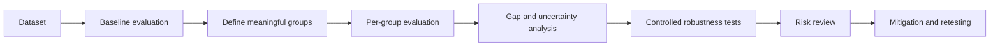

# Group Performance and Robustness Evaluation

An aggregate score can look acceptable while hiding weak performance for a particular cohort, environment, device, site, data source, or operating condition. This chapter shows how to evaluate those slices and how to test whether performance remains stable under controlled input changes.

## Learning objectives

By the end of this tutorial, you should be able to define meaningful groups, calculate per-group metrics, distinguish standalone performance from between-group disparity, identify unreliable small-group findings, design controlled robustness tests, and document acceptance decisions and mitigation actions.

## Evaluation workflow



## 1. Define groups before looking at results

Groups should be linked to the intended use and plausible sources of variation. Examples include age ranges, acquisition devices, environments, data sources, geographic regions, sites, operating modes, or combinations of these. Avoid creating many arbitrary slices after seeing the results because repeated exploratory comparisons can produce unstable findings.

Record the reason for each group, how it is derived, its sample size, outcome prevalence, and whether observations are independent. For image or time-series data, splitting and analysis should normally occur at the subject, case, session, or source level rather than the frame level.

## 2. Use more than one metric

For binary classification, useful per-group measures include precision, recall or sensitivity, specificity, F1, AUROC, AUPRC, Brier score, sample size, and prevalence. AUROC can remain high even when the selected threshold gives poor sensitivity. AUPRC is especially informative when the positive class is uncommon. Brier score describes probability error and is lower when probabilities are better calibrated and more accurate.

No single metric is sufficient. Select primary metrics based on the consequences of false positives, false negatives, ranking errors, and unreliable probabilities.

## 3. Separate four questions

**Standalone acceptability:** Does each group meet the minimum performance needed for the intended use?

**Between-group difference:** Is the absolute gap or performance ratio between groups acceptable, even when all groups pass a standalone threshold?

**Statistical reliability:** Are sample sizes and event counts sufficient, and are confidence intervals narrow enough to support a conclusion?

**Practical significance:** Would the observed difference matter in the real operating context? A statistically visible difference may be operationally trivial, while an uncertain but large possible degradation may require more evidence.

## 4. Gap measures

For a metric where higher is better:

```text
absolute gap = best group performance - worst group performance
performance ratio = worst group performance / best group performance
```

Also report the worst-group score directly. A small gap is not reassuring when every group performs poorly, and a strong average is not reassuring when the worst group performs poorly.

## 5. Confidence intervals and small groups

Confidence intervals show uncertainty, not acceptability. A small group can produce a very high or low point estimate with a wide interval. Treat findings as inconclusive when the group is too small, contains only one outcome class, has too few positive or negative cases, or contains correlated observations that were analysed as independent.

A minimum group size is a useful screening rule but should not be the only evidence rule. Event counts, class coverage, sampling design, and interval width also matter.

## 6. Robustness testing

Robustness testing applies controlled, plausible perturbations and compares the results with an unmodified baseline. Examples include numeric noise, image blur, compression, brightness changes, missing features, sensor dropout, feature scaling, prompt variations, class-prevalence changes, and data-source shifts.

Each test should specify the perturbation, severity, affected features, rationale, expected behaviour, metrics, acceptance criteria, and random seed. Test several severities where possible. Extreme corruption can be useful for stress testing, but it should not replace testing realistic operating conditions.

For a higher-is-better metric:

```text
performance change = perturbed performance - baseline performance
performance drop = max(0, baseline performance - perturbed performance)
```

For an error metric such as Brier score, an increase indicates degradation.

## 7. Acceptance criteria

Criteria must be project-defined rather than copied blindly. A complete decision rule may combine a minimum worst-group score, a maximum between-group gap, minimum evidence requirements, and a maximum permitted robustness degradation. Predefine which findings trigger investigation, additional data collection, threshold adjustment, recalibration, retraining, input-quality controls, restricted use, or monitoring.

Example only:

```yaml
minimum_worst_group_auroc: 0.75
maximum_auroc_gap: 0.12
minimum_group_size: 50
maximum_robustness_auroc_drop: 0.08
```

These numbers are illustrative and are not universal recommendations.

## 8. Mitigation and retesting

When a weakness is found, first verify data integrity and rule out leakage, duplicates, label problems, and incorrect grouping. Then investigate whether the difference is linked to representation, measurement quality, prevalence, threshold selection, calibration, or a true modelling limitation. Possible mitigations include collecting targeted data, improving labels, changing preprocessing, adjusting thresholds with care, recalibrating probabilities, retraining, adding input-quality checks, narrowing the operating scope, or adding human review.

Retest the affected groups and perturbations after mitigation. Also rerun the overall evaluation to detect regressions elsewhere.

## 9. Run the example

From the repository root:

```bash
python examples/group-performance-and-robustness/group_robustness_example.py
```

The example uses only synthetic data. It demonstrates per-group metrics, bootstrap intervals, gap summaries, controlled perturbations, and illustrative acceptance checks.

## 10. Reporting checklist

Document the model and dataset versions, analysis unit, group definitions, sample and event counts, threshold, metrics and confidence intervals, gap measures, perturbations and severities, random seeds, criteria, limitations, failures, mitigations, and retest outcomes. Do not report a group as safe or fair solely because a point estimate passes one threshold.
